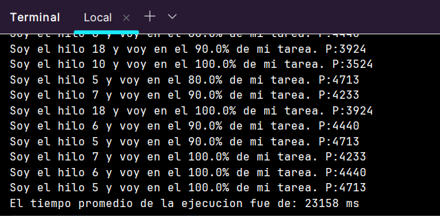

# ARSW_BarrierSyncProblem

**Escuela Colombiana de Ingeniería**  
**Software Architectures — Synchronization Workshop**  
**Barrier Synchronization Pattern**

---

## What is this?

This program uses **N threads**. Each thread does a task at a different speed.

The goal is to calculate the **average execution time** of all threads.

The problem: the main thread calculates the average **too early**, before the other threads finish.

---

## Project structure

```
src/
└── edu/eci/arsw/samples/
    ├── HiloProc.java   ← Each thread. It does a task and saves the time it took.
    └── Main.java       ← Main program. It starts the threads and calculates the average.
```

---

## Part 1 — Run the original program (without barrier)

### How to run

```
javac src/edu/eci/arsw/samples/*.java -d bin
java -cp bin edu.eci.arsw.samples.Main
```

You will see this message:

```
El tiempo promedio de la ejecucion fue de: 0 ms
```

### Questions and answers

**1. Is the result correct?**

No. The result is `0 ms`. That is wrong.

**2. Why does this happen?**

When `main` starts the threads, it does not wait for them to finish.  
It goes directly to calculate the average.  
At that moment, all threads are still running.  
The `resultado` variable in each thread is still `0` (its starting value).  
So the average is `0 + 0 + 0 + ... = 0`.

This is a **race condition**: `main` reads data before the threads write it.

---

## Part 2 — Fix with a barrier

### What is a barrier?

A barrier is a point in the code where a thread **stops and waits** for other threads to finish.

```
Without barrier:                     With barrier:
main → start threads                 main → start threads
main → calculate average ← WRONG     main → wait for all threads ← BARRIER
threads still running                threads finish
                                     main → calculate average ← CORRECT
```

### Solution — `Thread.join()`

`join()` makes `main` stop and wait until a thread finishes.

```java
// After start(), add this loop before the average calculation:
for (int i = 0; i < numHilos; i++) {
    try {
        hilos[i].join(); // main waits here until thread i finishes
    } catch (InterruptedException e) {
        e.printStackTrace();
    }
}
```

This is the barrier. `main` can only pass this loop when **all** threads are done.

### Why does this fix the problem?

Before the barrier: threads are still running, `resultado = 0`.  
After the barrier: all threads finished, `resultado` has the real time.  
Now the average is correct.

---

## Part 3 — Check the solution

After adding the barrier, verify:

- All threads print `100.0%` of their task.
- The average message appears **after** the last thread finishes.
- The average value is greater than `0 ms`.

---

## Evidence execution



---

## Author

**Adrian Ducuara**  
[github.com/DUCU844](https://github.com/DUCU844)
